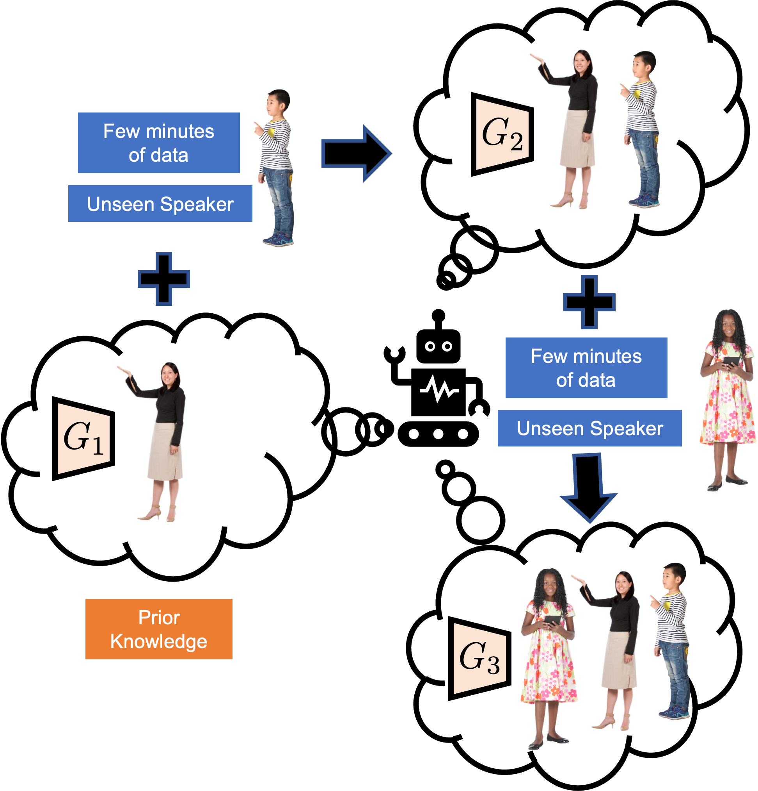

# C-DiffGAN

This is the official repository for the paper *Continual Learning for Personalized Co-Speech Gesture Generation*.

[Chaitanya Ahuja](http://chahuja.com), [Pratik Joshi](https://pratikmjoshi.github.io/), [Ryo Ishii](https://www.rd.ntt/e/organization/researcher/special/s_060.html), [Louis-Philippe Morency](https://www.cs.cmu.edu/~morency/) - [ICCV2023](https://iccv2023.thecvf.com/)

[](https://opensource.org/licenses/MIT)

Links: [Paper](https://openaccess.thecvf.com/content/ICCV2023/papers/Ahuja_Continual_Learning_for_Personalized_Co-speech_Gesture_Generation_ICCV_2023_paper.pdf), [Demo+Project Website](http://chahuja.com/mix-stage), [Dataset Website](http://chahuja.com/pats)

Bibtex:

```sh
@inproceedings{Ahuja_2023_ICCV,
    author={Ahuja, Chaitanya and Joshi, Pratik and Ishii, Ryo and Morency, Louis-Philippe},
    title={Continual Learning for Personalized Co-speech Gesture Generation},
    booktitle={Proceedings of the IEEE/CVF International Conference on Computer Vision (ICCV)},
    month={October},
    year={2023},
    pages={20893-20903}
}
```

## Overview
# Overview



This repo has information on the training code and pre-trained models. 

**Dataset**: This repo uses a different version of [PATS](https://chahuja.com/pats/) dataset for our gesture generation experiments. The dataset link for download is here: googledrivelink

**Sections:** The repo is divided into the following:
- [Setting up repo](##setting-up-the-repo).
- [Environment setup and library installations](##environment-setup-and-library-installations)
- [Training a Gesture Generation Model](##training-a-gesture-generation-model)
- [Inference from a trained model](##inference-from-a-trained-model)
- [Generating rendered samples](##generating-rendered-samples)

## Setting up the repo
The repo can be cloned by running: 
```
git clone https://github.com/chahuja/cdiffgan
```
*Note that this only contains the scripts and not the data.*

## Environment setup and library installations

1. **Install pycasper**

This is a library for keeping variable names, state tracking and logging within the repo. Run the following:
```
cd cdiffgan
mkdir ../pycasper
git clone https://github.com/chahuja/pycasper ../pycasper

cd src
ln -s ../../pycasper/pycasper .
```

2. **Create anaconda environment**

Conda installation is a bit cumbersome, and may require some trial and error. However, there are 2 main scripts you can look at. First you need to create an anaconda environment. **Note that the environment has to be called `torch`**. Try running these commands (preferably one by one):
```
conda env create --file=conda_requirements.yml
conda activate torch
pip install -r pip_requirements.txt
```
If you encounter any errors/conflicts when running `conda env create`, you may need to look at unresolved dependencies. You may need to manually install these packages step by step. To do so, for any libraries giving errors within conda_requirements.yml, run with the appropriate channel after `-c`. The version number is shown in [conda_requirements.yml](/src/conda_requirements.yml):
```
conda install -c [pytorch | conda-forge | defaults | nvidia] <LIBRARY NAME>=<VERSION>

# e.g. conda install -c pytorch torchvision=0.8.1
```

If there are unresolved dependencies or uninstalled library errors (belonging to [pip_requirements.txt](/src/pip_requirements.txt)) that occur during conda env create, run pip installs as (make sure you are inside the environment):
```
pip install <LIBRARY NAME>==<VERSION>
```

To confirm, you may need to run the subsequent training and inference scripts to see if the environment operates as needed.

3. **Dataset Storage**
Unzip the downloaded dataset inside `cdiffgan/datasets/`. 

## Training a Gesture Generation Model
**Note that this repository requires SLURM or some equivalent scheduler. If you do not have it, alternate steps are listed.** 

### 1. Create a save directory

 `mkdir cdiffgan/src/<save_dir_name>`. This is where all the trained model weights, and even the renders will be stored. For convenience, call this `save/`. If possible, create the save directory within `cdiffgan/src/`. If there is a space issue, you can create a softlink inside `cdiffgan/src/` to a save directory outside the repo, via:
 ```
 cd src/
 ln -s <YOUR_SAVE_DIRECTORY> save/
 ```

### 2. Choose the script/model you want to train. 

These scripts are stored in `src/jobs/cl`. 
   1. Mix-StAGE model (full data): [`src/jobs/cl/t1/mixstage.py`](/src/jobs/cl/t1/mixstage.py)
   2. Mix-StAGE model (fewshot data): [`src/jobs/cl/t1/mixstage_fs.py`](/src/jobs/cl/t1/mixstage_fs.py)
   3. DiffGAN model: [`src/jobs/cl/t_n/no-replay-fs/diffgan3.py`](/src/jobs/cl/t_n/no-replay-fs/diffgan3.py)
   4. DiffGAN model (+continual learning loss): [`src/jobs/cl/t_n/pseudo-align-fs-src/diffgan3.py`](/src/jobs/cl/t_n/pseudo-align-fs-src/diffgan3.py) (This runs across 3 different random seeds. The script for a single seed is [`src/jobs/cl/t_n/pseudo-align-fs-src/diffgan3_singleseed.py`](/src/jobs/cl/t_n/pseudo-align-fs-src/diffgan3.py))

Each of these files will contain different subscripts per line which take a pretrained model, and decide a distribution of speaker data to run on. An example is shown here:
```
python train.py \
-cpk StyleDiffGAN4_G \ 
-tb 1 \
-exp 1 \
-modelKwargs '{"tgt_train_ratio": 1, "get_pretrained_D": 1}' \
-model StyleDiffGAN4_G \
-fewshot_seed 1 \
-k_shot 7 \
-note diffgan_pseudo-align-fs-src \
-speaker '[["oliver"], ["oliver", "maher"]]' \
-save_dir save7/cl/t2/pseudo-align-fs-src/diffgan_pseudo-align-fs-src/7/oliver-maher/1 \ 
-pretrained_model_weights save7/cl/t1/mixstage_t1/oliver/"$(ls save7/cl/t1/mixstage_t1/oliver | grep weights | tail -1)" \
-modalities '["pose/normalize", "audio/log_mel_400", "text/tokens"]' -fs_new '[15, 15, 15]' -input_modalities '["audio/log_mel_400", "text/tokens"]' -output_modalities '["pose/normalize"]' \
-gan align_diffgan \
-loss L1Loss -window_hop 5 -render 0 -batch_size 32 -num_epochs 20 -stop_thresh 3 -overfit 1 -early_stopping 1 -dev_key dev_FID -num_clusters 8 -feats '["pose", "velocity", "speed"]' -num_iters 200 -num_training_iters 200 -no_grad 0 -repeat_text 0 -dg_iter_ratio 1 -update_D_prob_flag 0 -cache 1 -replay pseudo-align-fs-src -paradigm no_src_tgt || exit

``` 
Some relevant flags (the rest of the flags can be kept as is):

- `-cpk` : The type of pretrained model being loaded. See ['src/trainer_chooser.py'](/src/trainer_chooser.py) for more details.
- `-model` : The type of model we want to train. Should ideally be the same as `-cpk`. See ['src/trainer_chooser.py'](/src/trainer_chooser.py) for more details.
- `-fewshot_seed` : Random seed for different runs. Keep this as 1 across an entire experiment.
- `-k_shot` : The amount of fewshot training data per speaker that the model trains on. Values here include 7 (30s per speaker),28 (2 minutes per speaker),140 (10 minutes per speaker).
- `-note` : The unique ID of the training run. Set this to something you can remember. This is for logging and storing reasons.
- `-speaker` : This is a string of a list of lists. The first sublist contains the speaker that the initial model was trained on. The following speakers define what speakers have and will be trained over in the run. 
- `-save_dir` : **This is an important change. Please change the head save directory's name to whatever you named it (a.k.a <save_dir_name>='save/', replace 'save7' with 'save').**
- `-pretrained_model_weights` : Path to pre-trained model weights to load from. 

The rest of the flags should remain constant to the script that exists. In general, you will only need to change `-note`,`-save_dir`,`pretrained_model_weights`. You can see that in the scripts, each subsequent run loads the model trained in the previous training subscript. 

### 3a. Train model with job.py (with SLURM)
First, enter `src/`:
```
cd src/
```
`src/job.py` is the central script for running training. It will create and schedule SLURM jobs based on the script you chose in the previous example. An example run command would look like this (do not activate your conda environment here, aka don't run `source activate torch` before running this. The selected script already activates torch):
```
python job.py -mail END -t 3-00:00 -p gpu_high -mem 30000 -c 1 -gpu 1 -job jobs/cl/t_n/pseudo-align-fs-src/diffgan3.py -lines 8 -successtest 1
```
What this does is that it schedules the job on a `gpu_high` type node, with 1 cpu node (`-c`), 1 GPU (`-gpu`), and runs the DiffGAN model (+continual learning loss) script, which is selected from the 4 options in the previous step. `-lines` refers to the number of lines in the script that should be executed per GPU. In the case that `-gpu > 1`, the first 8 lines would be parallelly run by one node, and the second 8 by the second node, and so on. **However** for the continual learning setting, the sequential learning of speakers should be done in one node. If you see the first 8 lines of `src/jobs/cl/t_n/pseudo-align-fs-src/diffgan3.py`, it is an entire continual learning run for one random seed `fewshot_seed=1`. The next 8 are for another random seed. 

This will set of a bunch of jobs (>=1), and you'll also see a sticky successtest job that will run as long as the training jobs are running properly. If any of them end in an error, then the successtest will go into a DependencyNeverSatisfied status (will need to `scancel` that job). 

### 3b. Train model with job.py (without SLURM)
If you don't have SLURM, take a look at the source script in detail (a.k.a `jobs/cl/t_n/pseudo-align-fs-src/diffgan3_singleseed.py` or the equivalent). Run `source activate torch` only once, and then run every even line together. You can comment out the `source activate torch` lines in the script. Also, remove the `|| exit` from the end of each even line. For example, `diffgan3_singleseed.py` currently looks like:
```
source activate torch
python train.py -cpk StyleDiffGAN4_G -tb 1 -exp 1 ... || exit
source activate torch
python train.py -cpk StyleDiffGAN4_G -tb 1 -exp 1 ... || exit
source activate torch
python train.py -cpk StyleDiffGAN4_G -tb 1 -exp 1 ... || exit
source activate torch
python train.py -cpk StyleDiffGAN4_G -tb 1 -exp 1 ... || exit

```

With the changes, it will look something like: 
```
source activate torch
python train.py -cpk StyleDiffGAN4_G -tb 1 -exp 1 ... 
python train.py -cpk StyleDiffGAN4_G -tb 1 -exp 1 ... 
python train.py -cpk StyleDiffGAN4_G -tb 1 -exp 1 ... 
python train.py -cpk StyleDiffGAN4_G -tb 1 -exp 1 ... 
```

Now, directly run the script on the GPU (even though the extension is `.py`, it is actually a bash script): 
```
sh jobs/cl/t_n/pseudo-align-fs-src/diffgan3_singleseed.py
```

### 4a. Debugging Logs (with SLURM)
The best place to look in case of any errors are is the `src/.log/` directory. It contains the same directory structure as your save directory. For example, say I start a run with job ID `111111`, running script `src/jobs/cl/t_n/pseudo-align-fs-src/diffgan3_singleseed.py`, the 2 log files will be:
```
src/.log/cl/t_n/pseudo-align-fs-src/diffgan3_singleseed_111111_<possible_extra_id>.err
src/.log/cl/t_n/pseudo-align-fs-src/diffgan3_singleseed_111111_<possible_extra_id>.out
```
These will be useful in debugging any potential issues. 

### 4b. Debugging Logs (without SLURM)
Errors and outputs will be directly printed. 

### 5. Successful training run
After a successful training run, your save_dir (e.g. `save/`) will be populated. For example, a successful run of `diffgan3_singleseed.py` will have a save structure that looks like:
```
save/cl/(t1|t2|t3|t4|t5)/pseudo-align-fs-src/diffgan_pseudo-align-fs-src/7/...
<save_dir>/cl/<save after training on 1,2,3,4,5 speakers>/pseudo-align-fs-src/<note_name>/<k_shot>/...
```

The leaf of save directory will contain files similar to this:
```
exp_8103_cpk_StyleDiffGAN4_G_speaker_[['oliver'], ['oliver', 'maher', 'chemistry', 'ytch_prof', 'lec_evol']]_model_StyleDiffGAN4_G_note_diffgan_pseudo-align-fs-src/
exp_8103_cpk_StyleDiffGAN4_G_speaker_[['oliver'], ['oliver', 'maher', 'chemistry', 'ytch_prof', 'lec_evol']]_model_StyleDiffGAN4_G_note_diffgan_pseudo-align-fs-src_args.args
exp_8103_cpk_StyleDiffGAN4_G_speaker_[['oliver'], ['oliver', 'maher', 'chemistry', 'ytch_prof', 'lec_evol']]_model_StyleDiffGAN4_G_note_diffgan_pseudo-align-fs-src_cummMetrics.json
exp_8103_cpk_StyleDiffGAN4_G_speaker_[['oliver'], ['oliver', 'maher', 'chemistry', 'ytch_prof', 'lec_evol']]_model_StyleDiffGAN4_G_note_diffgan_pseudo-align-fs-src_histogram.json
exp_8103_cpk_StyleDiffGAN4_G_speaker_[['oliver'], ['oliver', 'maher', 'chemistry', 'ytch_prof', 'lec_evol']]_model_StyleDiffGAN4_G_note_diffgan_pseudo-align-fs-src_log.log
exp_8103_cpk_StyleDiffGAN4_G_speaker_[['oliver'], ['oliver', 'maher', 'chemistry', 'ytch_prof', 'lec_evol']]_model_StyleDiffGAN4_G_note_diffgan_pseudo-align-fs-src_metrics.json
exp_8103_cpk_StyleDiffGAN4_G_speaker_[['oliver'], ['oliver', 'maher', 'chemistry', 'ytch_prof', 'lec_evol']]_model_StyleDiffGAN4_G_note_diffgan_pseudo-align-fs-src_name.name
exp_8103_cpk_StyleDiffGAN4_G_speaker_[['oliver'], ['oliver', 'maher', 'chemistry', 'ytch_prof', 'lec_evol']]_model_StyleDiffGAN4_G_note_diffgan_pseudo-align-fs-src_res.json
exp_8103_cpk_StyleDiffGAN4_G_speaker_[['oliver'], ['oliver', 'maher', 'chemistry', 'ytch_prof', 'lec_evol']]_model_StyleDiffGAN4_G_note_diffgan_pseudo-align-fs-src_style.pkl
exp_8103_cpk_StyleDiffGAN4_G_speaker_[['oliver'], ['oliver', 'maher', 'chemistry', 'ytch_prof', 'lec_evol']]_model_StyleDiffGAN4_G_note_diffgan_pseudo-align-fs-src_tb/
exp_8103_cpk_StyleDiffGAN4_G_speaker_[['oliver'], ['oliver', 'maher', 'chemistry', 'ytch_prof', 'lec_evol']]_model_StyleDiffGAN4_G_note_diffgan_pseudo-align-fs-src_weights.p
```

The suffixes here are the most important, and we will use them later. Also, each new exp will create a new enumeration for the prefix `exp_<NUM>`.

## Inference from a trained model
TODO

## Generating rendered samples
Once the model has been trained, you can use the saved model files to generate gestures and renders for the evaluation and test data of PATS. The command to do so is:
```
python render.py -load  <save_file>/...weights.p  -render 20

e.g. 
python render.py -load  save/cl/t5/pseudo-align-fs-src/diffgan_pseudo-align-fs-src/7/oliver-maher-chemistry-ytch_prof-lec_evol/1/exp_8103_cpk_StyleDiffGAN4_G_speaker_\[\[\'oliver\'\]\,\ \[\'oliver\'\,\ \'maher\'\,\ \'chemistry\'\,\ \'ytch_prof\'\,\ \'lec_evol\'\]\]model_StyleDiffGAN4_G_note_diffgan_pseudo-align-fs-src_weights.p  -render 20
```

This will generate 20 renders using the `weights.p` from your saved training files. These are the saved weights from your training. The renders will be saved in the same subdirectory that your `weights.p` is saved. It will be in a subfolder called `render/`. e.g.
```
save/cl/t5/pseudo-align-fs-src/diffgan_pseudo-align-fs-src/7/oliver-maher-chemistry-ytch_prof-lec_evol/1/exp_8103_cpk_StyleDiffGAN4_G_speaker_\[\[\'oliver\'\]\,\ \[\'oliver\'\,\ \'maher\'\,\ \'chemistry\'\,\ \'ytch_prof\'\,\ \'lec_evol\'\]\]model_StyleDiffGAN4_G_note_diffgan_pseudo-align-fs-src/render/
``` 

You can do the same for saved weights after running on a subsequence of speakers. Simply going to the `t3` or `t4` save files and doing the render will do the job. 